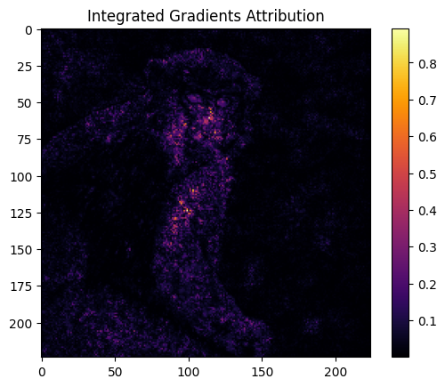
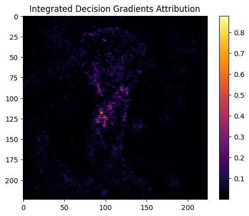

# Integrated Gradients and Integrated Decision Gradients
### Initial Implementation Results 

This report summarizes the scratch implementation of two influential attribution algorithms: Integrated Gradients (IG) and the recently proposed Integrated Decision Gradients (IDG). Both methods aim to explain neural network decisions by assigning importance scores to input features, but they differ fundamentally in how they handle model saturation.

## Implementation Methodology

Integrated Gradients (Sundararajan et al.) and Integrated Decision Gradients (Walker, Jha, et al.) were implemented using PyTorch.Both notebooks utilize a pretrained ResNet50 model (IMAGENET1K_V1) to attribute model decisions back to input pixels without external attribution libraries. 

Integrated Gradients (IG) is implemented using a straight-line path from a black baseline ($x'$) to the input image ($x$), approximated via a Riemann sum over $m$ discrete steps. The formula used is:

$$IG_i(x) = (x_i - x'_i) \times \int_{\alpha=0}^{1} \frac{\partial F(x' + \alpha(x - x'))}{\partial x_i} d\alpha$$

Integrated Decision Gradients (IDG) extends the standard Integrated Gradients (IG) method by scaling each sampled gradient by an Importance Factor, which represents the derivative of the model's confidence with respect to the path. This approach provides a principled solution to the saturation problem by amplifying "high-quality" gradients from the region where the model makes its decision and muting noisy gradients from saturated regions. The formula used is:

$$IDG_i(x) = \frac{(x_i - x'_i)}{m} \times \sum_{k=1}^{m} \frac{\partial F(x'_i + \frac{k}{m}(x_i - x'_i))}{\partial x_i} \frac{\partial F}{\partial \alpha} d\alpha$$

## Testing and Results

Initial testing on the provided dataset shows clear differences in attribution behavior. The original image was processed through both methods to identify which pixels most influenced the "macaque" (a species of monkey) classification. The following is the original monkey image after the preprocessing steps:

The integrated gradients attribution method displays high-frequency pixel importance, highlighting fine textures and edges across the subject. While mathematically sound, it includes significant noise from the background and peripheral features.

In contrast, the IDG implementation produces a more concentrated heatmap. It filters out background noise to focus on semantically relevant regions, such as the facial structure and primary body shape, providing a clearer "decision-centric" explanation of why the model chose the specific class.

## Conclusion

While IG provides a strong axiomatic foundation, it suffers from the saturation effect, where gradients from non-informative regions of the path degrade the explanation. IDG provides a principled solution by weighting gradients by their actual impact on the model's transition from a baseline state to a final decision.